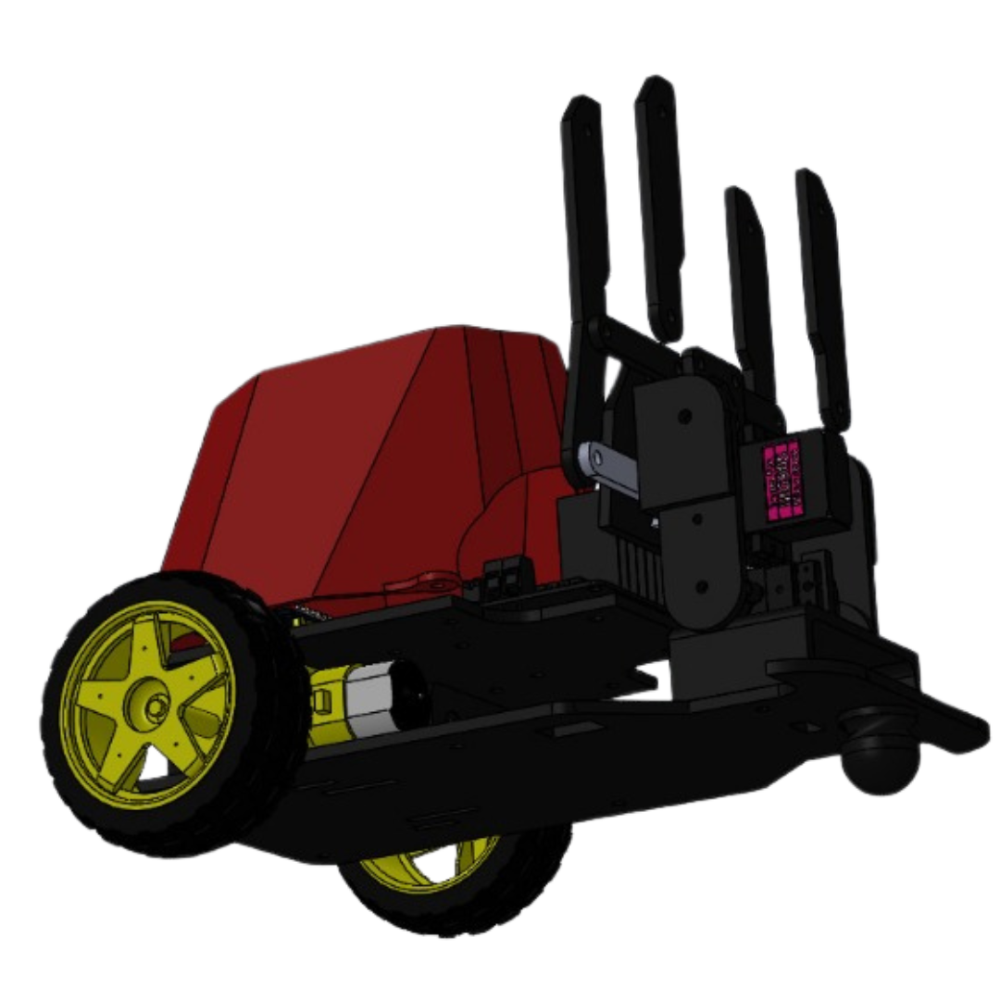
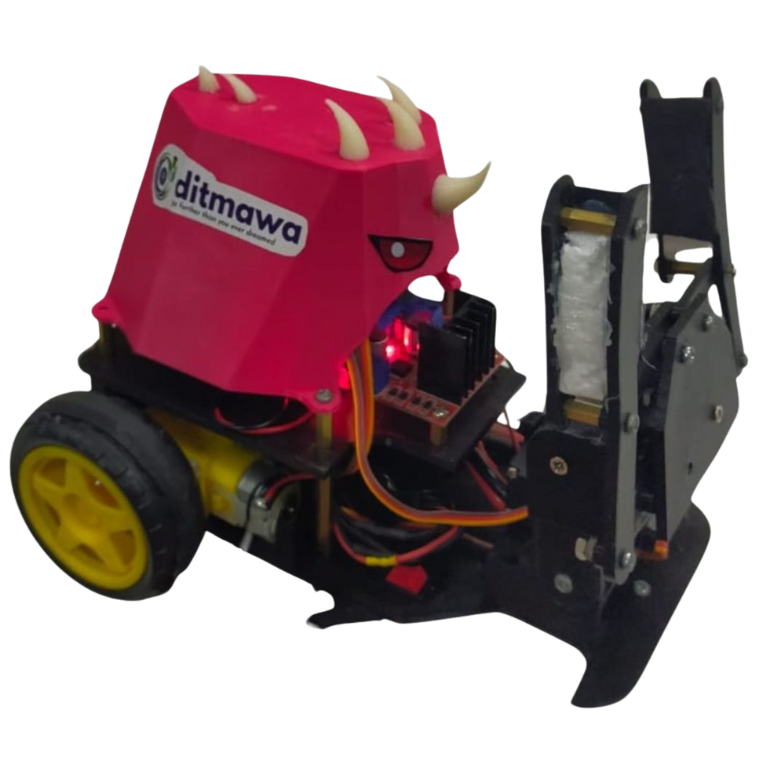
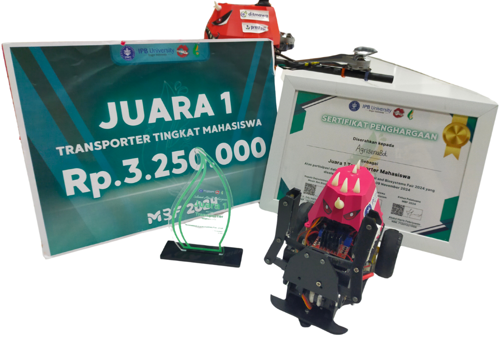

# Transporter Robot  
This project features a two-wheeled transporter robot manually controlled via a PlayStation 3 wireless joystick over Bluetooth. Driven by an ESP32 running Arduino code, the robot includes a motorized gripper that can open, close, and move vertically to pick up and move objects.

## Transporter Robot Using ESP32 and PS3 Joystick

### 📘 Introduction  
The Transporter Robot project aims to build a two-wheeled robot capable of manually transporting objects in a controlled environment using a Bluetooth-connected PlayStation 3 joystick. The robot is powered by an ESP32 microcontroller running Arduino code. It features a dual-servo gripper system—one for lifting and one for gripping—and DC motors for directional movement.

### ⚙️ Key Features  
- **Manual Control:** Operated via a PS3 joystick connected through Bluetooth using MAC address pairing.  
- **Motorized Gripper System:**  
  - **MG90S Servo:** Controls the open/close movement of the gripper.  
  - **MG996R Servo:** Controls the vertical movement of the gripper for lifting.  
- **Two-Wheel Drive:** Two DC motors for movement—forward, backward, turning left/right.  
- **Stable Power Supply:** 3S LiPo battery regulated by LM2596 to 5V for safe component operation.  
- **Compact & Modular Design:** Frame and gripper parts are custom-designed and 3D printed.

### 🧰 Components Required  
- ESP32 Development Board  
- 2× DC Motors  
- 1× MG90S Servo Motor (gripper control)  
- 1× MG996R Servo Motor (gripper lift)  
- L298N Motor Driver Module  
- 3S LiPo Battery  
- LM2596 Step-down Voltage Regulator (12V to 5V)  
- PS3 Wireless Bluetooth Joystick  

### 📡 Bluetooth Pairing (PS3 to ESP32)  
1. Use a tool like **SixaxisPairTool** to check and change your PS3 joystick’s MAC address.  
2. In your Arduino code, call `PS3.begin("xx:xx:xx:xx:xx:xx")` with your **ESP32’s MAC address**.  
3. Upload code to ESP32.  
4. Press the **PS button** on the controller to connect.  
5. Successful connection: LED on PS3 stays solid.

### 🔌 Wiring Diagram  
Basic wiring includes -- diagram image will be soon:  
- DC motors connected to L298N motor driver  
- Servo motors connected to PWM pins on ESP32  
- Voltage from LiPo battery stepped down to 5V for ESP32 and servos  
- Bluetooth communication via onboard ESP32 module  
---
## Documentation

### Design Robot 
<p align="center">
  <a href="https://skfb.ly/pwtIJ">
    
  </a>
</p>

<p align="center">
  🔗 Click the image to view the interactive 3D model on Sketchfab.
</p>

### Final Build  
<div align="center">
  
</div>

## 🎉 Competition Success

Here’s our transporter robot that helped us bring home the prize at the Mechanical and Biosystems Fair 2024!

<div align="center">
  
</div>
```
